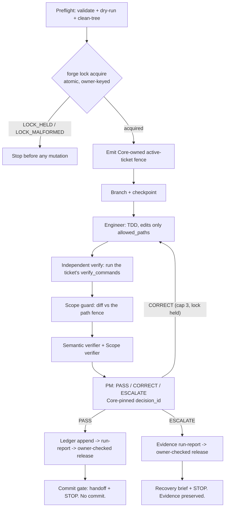
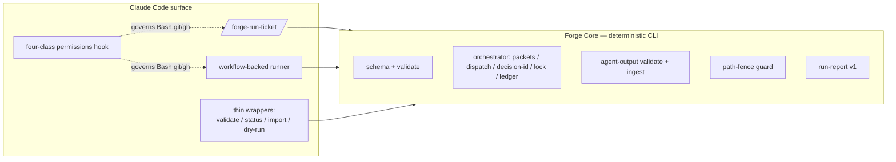

# ForgeGate

> **A control system for Claude Code.** It lets AI help build software quickly, but with guardrails:
> one task at a time, clear boundaries, required tests, independent review, and human approval before
> anything important is committed or merged.

[](https://github.com/dsj7419/forge-gate/actions/workflows/ci.yml)


---

## What is ForgeGate?

ForgeGate is a **safety and project-management layer for Claude Code**. Instead of asking an AI to write
code and hoping it behaves, ForgeGate turns the work into a controlled process: **define the task, set the
boundaries, have the AI do the work, then require independent review, testing, and human approval before
anything important happens.**

It is built for people who want the speed of AI-assisted coding without losing control. ForgeGate keeps the
AI focused on **one approved task at a time**, prevents it from wandering into unrelated files, records what
happened, runs the checks itself, and **stops at the right gates** before commits, pull requests, or merges.

In plain English: it makes Claude Code act less like a loose chatbot and more like a disciplined engineering
team — developer, reviewer, scope/safety officer, and project manager — with an approval process built in.
The goal is not just faster coding; it is **trustworthy AI-assisted software development**: clear scope, clean
evidence, safer changes, fewer surprises, and a human still in charge of every major decision.

### The two pieces

| | |
|---|---|
| **Forge Core** | A deterministic, CLI-first, runtime-agnostic TypeScript engine (`forge-core` package, `forge` binary). It does all the deterministic work — contract validation, ticket selection, path fences, schema-validated agent I/O, decision provenance, run-report attestation, cross-run locking. **Zero LLM/prompt logic.** It runs from a plain terminal. |
| **ForgeGate** | The Claude Code surface on top of Core: thin slash-command wrappers, the agent charters, and the interactive one-ticket orchestrators. The wrappers add no logic; the orchestrator is *mechanical* (it dispatches agents, runs Core, does git, pauses at gates) and makes no code judgments of its own. |

> **The contract is one-directional: Claude Code consumes Forge Core, never the reverse.** Core is the source
> of truth; the AI surface is a convenience layer over it.

---

## The governed loop

One ticket flows through a fixed pipeline and stops at the commit gate. Nothing is improvised, and the
orchestrator trusts Core's verdicts — never an agent's narrative.



Every agent output is **captured verbatim and validated by Core** (`forge parse-agent`) before the run
continues — malformed output halts, it is never repaired. The PM's `decision_id` is **assigned by Core** from
a per-epic ledger and cross-checked, so it can't be invented or duplicated. On PASS the run produces a
Core-owned, schema-validated `forge-run-report/v1` whose safety fields are typed `false`, then **stops for a
human**.

---

## Architecture



**Core vs. orchestrator** is the load-bearing split. Core (`src/`) is deterministic, typed, unit-tested
TypeScript. The orchestrators (a Markdown command and a workflow script) are the only components that dispatch
agents, run git, and pause at gates — and they own **no** governance logic: no gate computation, no
decision-id assignment, no schema validation, no path-fence decisions, no safety attestation. They call Core
for all of it.

**Two repos, kept distinct.** `FORGE_REPO` locates the CLI; the **target repo** (the project being modified)
is resolved from the Claude Code session's git root and pinned via `--repo-root`. They coincide only for
ForgeGate self-runs; for any other project they differ, which is what makes ForgeGate usable on external repos.

---

## What's shipped

Everything below exists today, is unit-tested (**624 tests / 40 files, green in CI**), and has been exercised
through the governed loop.

### Governance engine (Forge Core)
- **Contract model** — epic / sprint / ticket as YAML + Markdown, with strict Zod schemas at every boundary.
- **`validate`** — read-only contract integrity + readiness + auto-escalation checks. A hard precondition for execution; modifies nothing.
- **`run --dry-run`** — selects the next ready ticket and reports gate, branch, dependency reasoning, and escalation state. Read-only.
- **`active-ticket`** — emits the Core-owned `forge-active-ticket/v1` fence (absolute repo_root, paths, branch) that the guard and run-report consume.
- **`packets` / `dispatch`** — deterministic per-role dispatch context and specs for engineer, semantic verifier, scope verifier, and PM. Registered subagent type when available; verbatim injected-charter fallback otherwise — never an improvised prompt.
- **`parse-agent`** — validates structured agent output (YAML *or* JSON) against the role schema. Malformed output is rejected, never repaired.
- **Core-pinned `decision_id`** — assigned monotonically from a per-epic ledger; the PM echoes it verbatim and Core cross-checks. Duplication and renumbering are structurally impossible.
- **`run-report write`** — Core-owned `forge-run-report/v1`. Safety fields (`committed`, `pushed`, `pr_opened`, `merged`, `status_write_back`, `journal_written`) are typed `z.literal(false)` — the v1 thesis lives in the type system, so it can't be flipped without a v2 bump.
- **`importer`** — normalizes a legacy sprint folder into the canonical contract; writes `TODO` placeholders rather than inventing ambiguous fields (a human-completion draft).

### Agent workflow
- **One governed self-run** — engineer → independent verify → scope guard → semantic verifier → scope verifier → PM, stopping at the commit gate.
- **Verbatim capture protocol** — one action per step: dispatch → wait → capture byte-for-byte → `parse-agent` → continue only on success. No pre-writing, summarizing, reconstructing, composing, or batching. Lock-tested so the discipline can't silently drift.
- **Independent verification** — the orchestrator re-runs the ticket's `verify_commands` itself; it never trusts the engineer's claim.
- **Anti-theater verifiers** — verdicts must cite concrete evidence; "looks good" is invalid; the PM may not PASS over a REJECT without a recorded override + human escalation.

### Permissions substrate (the prevent layer)
- **Four-class Claude Code permissions hook** (PreToolUse, Bash) — judges every git/gh command by intent:
  - **Class 1 — read-only / local git** → allow (`status`, `diff`, `log`, `show`, `rev-parse`, branch list, `fetch`, `pull --ff-only`, `switch <branch>`).
  - **Class 2 — explicit-path staging** → allow (`git add <path>`; `.`/`-A`/glob denied).
  - **Class 3 — reversible PR workflow** → allow (`git push -u origin <feature-branch>`, `gh pr create|view|checks`).
  - **Class 4 — destructive / outward / approval-gated** → deny (force-push, push-to-main, `reset --hard`, branch delete, `merge`/`rebase`, `gh pr merge`, `gh api` mutation, `restore`/`checkout -- <path>`, `clean`, and any complex/dynamic/obfuscated git/gh form). Non-git/gh commands pass through. **Fail-closed.**
  - A `forge-*` runner agent is restricted to **read-only git only** (L3).
- **Human bypass is explicit:** `!`-prefixed commands run in the human's own shell and bypass the agent hook — that *is* the human gate for commit / branch-create / merge.

### Cross-run concurrency (epic locking)
- **Core epic-lock primitive** — atomic exclusive-create (`O_EXCL` / `wx`): the create *is* the mutual exclusion, so there is no check-then-act TOCTOU. Typed `forge-lock/v1` record keyed by `run_id`.
- **`forge lock acquire | release | status`** — real `defaultLockIo` filesystem binding; owner-checked release; report-only stale verdict (never clears or steals); malformed locks fail closed.
- **Both orchestrators are wired to it** — the command runner (`/forge-run-ticket`) and the workflow-backed runner both acquire before any mutation, hold across correction cycles, and release owner-checked on PASS / terminal outcomes.
- **Atomic / CAS decisions-ledger append** — defense-in-depth: ledger appends can't duplicate or clobber decisions under concurrent interleavings, even if the lock is bypassed.

### Human-gated delivery
- **Stops at the commit gate.** On PASS it prints the handoff (changed files, verification summary, PM decision, a *proposed* status transition, a suggested commit message and `git add`/`git commit`) and stops. It never commits.
- **No auto push / PR / merge. No status write-back. No journal write.** All deliberately out of scope for v1.
- **Failed runs preserve evidence** — write the run-report, leave branch + tree intact, produce a recovery brief with *suggested* (not executed) cleanup.

### CI / green-tree protection
- **GitHub Actions CI** on every PR and push to `main` — Node 22, pinned `pnpm@10.33.0`, frozen install → typecheck → test. The green-tree invariant is machine-backed.

---

## Quickstart

```bash
pnpm install
pnpm build
node dist/cli.js validate docs/epics/forge-self-improvement      # read-only contract validation
node dist/cli.js run docs/epics/forge-self-improvement --dry-run  # preview the next ready ticket
```

The CLI subcommands are read-only and safe from a plain terminal. For the full orchestration loop, run
`/forge-run-ticket <epic-path>` **inside Claude Code** — the interactive entry point that dispatches the agents
and pauses at the commit gate.

---

## Command reference

<details>
<summary><strong>Full <code>forge</code> CLI surface</strong> (click to expand)</summary>

```
forge validate <epic-path> [--json]            Read-only contract validation. Default mode writes
                                               .forge/validation-report.json; --json prints JSON, writes nothing.

forge status <epic-path>                       Summarize epic id, sprint ids, ticket counts, finding totals.

forge run <epic-path> --dry-run [--json]       Read-only execution preview: next ready ticket, dependency
                                               reasoning, paths, verify commands, effective gate, proposed
                                               branch, and the agent chain that WOULD run. (Live run is the
                                               orchestrator's job, not a CLI subcommand.)

forge import --from-existing <legacy> --out <epic-root> [--dry-run] [--json]
                                               Normalize a legacy sprint folder into the canonical contract.
                                               Output dir must be empty/absent (no --force). Source untouched.

forge packets <epic-path> [--repo-root <p>]    Deterministic run-packet set for the next ready ticket.

forge dispatch <engineer|semantic-verifier|scope-verifier> <epic-path> [--repo-root <p>]
                                               Build one agent's dispatch spec {role, subagent_type, mode, prompt}.
forge dispatch pm <epic-path> [--assigned-decision-id <D-NNN>] [--engineer-output <f> --semantic-output <f>
                              --scope-output <f> --facts <f.json>] [--repo-root <p>]
                                               Re-validate upstream outputs + facts, embed them verbatim, and
                                               render the Core-pinned decision_id into the PM prompt.

forge ledger append <epic> --decision-id <D-NNN> --ticket <ticket> --branch <branch>
                                               Atomic/CAS append to the per-epic decisions ledger.

forge lock acquire <epic> --run-id <id> --session-id <s> --ticket <t> --branch <b> --repo-root <r>
forge lock release <epic> --run-id <id>
forge lock status  <epic> [--heartbeat-ttl-ms <n>] [--acquire-ttl-ms <n>]
                                               Cross-run epic lock. Acquire = atomic exclusive-create
                                               (LOCK_HELD on collision, never overwrites). Release = owner-checked
                                               by run_id (LOCK_FOREIGN/LOCK_ABSENT). Status = report-only stale
                                               verdict (never clears or steals). Fail-closed throughout.

forge parse-agent <role> (--file <p> | --stdin | --json-file <p> | --json-stdin) [--expected-decision-id <D-NNN>]
                                               Validate structured agent output against the role schema.
forge agent-schema <role>                      Emit the JSON Schema for a role's structured output.

forge active-ticket <epic-path> [--json] [--repo-root <p>]
                                               Emit the Core-owned forge-active-ticket/v1 fence.

forge guard paths [--active <active-ticket.json>] [--json] [--repo-root <p>]
                                               Deterministic, read-only check that the worktree stays inside the
                                               active ticket's fence. Exit 0 inside, 1 on violation, 2 usage.

forge run-report write <epic-path> --repo-root <p> --result PASS|ESCALATE --ticket-title <s>
                       --checkpoint-base <sha> --checkpoint-head <sha> --guard-result <s> --guard-exit <n>
                       --gate-declared <g> --gate-effective <g> --gate-human-required <true|false> [...]
                                               Write the Core-owned forge-run-report/v1 (safety fields typed false).

forge verify-install                           Read-only install-currency check: compare this checkout's
                                               commands/ + agents/ against the installed copies under ~/.claude.
```

**Exit codes:** `0` success · `1` failure (findings, blocked dry-run, invalid agent output, guard violation, write failure) · `2` usage error.

</details>

| Slash command | Runs |
|---|---|
| `/forge-validate <epic-path>` | `forge validate` |
| `/forge-status <epic-path>` | `forge status` |
| `/forge-import --from-existing <legacy> --out <epic-root> [--dry-run]` | `forge import …` |
| `/forge-run-dry-run <epic-path>` | `forge run … --dry-run` |
| `/forge-run-ticket <epic-path>` | Orchestrates ONE ticket (engineer → verifiers → PM); stops at the commit gate |

---

## The v1 safety model

Forge v1 is intentionally conservative and human-gated. The guarantees:

- **One ticket per run.** Exactly one ready ticket is selected and run.
- **Stops at the commit gate.** It never commits, pushes, opens a PR, or merges.
- **No status write-back, no journal write.** A run never mutates the contract's ticket status or `JOURNAL.md`/`DECISIONS.md`. *(Completed tickets may still read `status: pending` on disk — expected for now; trust git/PRs for ground truth.)*
- **The engineer edits only `allowed_paths`.** The diff is independently scope-checked against the fence.
- **`.forge/` runtime artifacts are gitignored** (`active-ticket.json`, `lock.json`, `run-report.json`, `decisions-ledger.json`, captured agent outputs, reports).
- **Cross-run serialization by epic lock.** A second run on the same epic fails closed at the atomic acquire, before any mutation.
- **Failed runs preserve evidence** and leave the tree intact.

### How "safe" is enforced — be precise

ForgeGate's safety comes from **distinct layers**, and it's worth knowing which *prevents* vs. which *detects*:

| Layer | Mechanism | Guarantee |
|---|---|---|
| **Core** | typed schemas, pinned decision_id, `safety.*` literal-false, run-report attestation | **validates & attests** — improvisation is rejected at parse time |
| **Path-fence guard** | deterministic diff-vs-fence check | **detects** scope violations and fails the run (post-hoc, not a hard block on the edit) |
| **Permissions hook** | PreToolUse Bash classifier | **prevents** unsafe substrate actions (git/gh) at the tool boundary; reloads on settings change; `!` is the human bypass |
| **Orchestration discipline** | instruction + protocol-lock tests + disclosed-departure | **constrains** the runner; not structurally enforced by Core — a determined operator could deviate, but the lock tests keep the written discipline from silently disappearing |

The honest one-liner: **Core attests, the guard detects, the permissions hook prevents, and the human approves.**
No layer here claims full autonomy or unsupervised readiness.

### Not autonomous / not magic

Forge **structures** Claude Code work and enforces discipline; it does **not** take over responsibility. The
human stays accountable for what gets committed, pushed, or merged. v1 always stops at the commit gate.

---

## Cross-run concurrency & locking

Two runs on the same epic must not both proceed — they would race on the decisions ledger and overwrite each
other's evidence. ForgeGate closes this with a Core-owned **epic lock**:

- **Acquire is the gate.** `forge lock acquire` atomically creates `<epic>/.forge/lock.json` (`O_EXCL`/`wx`).
  The create *is* the mutual exclusion — there is no separate existence check, so no check-then-act window. A
  collision returns `LOCK_HELD` and **never overwrites** the holder.
- **Release is owner-checked.** Only the run that holds the matching `run_id` can release; a foreign/absent/
  malformed result is reported, **never force-cleared**.
- **Both orchestrators are serialized by it** — the command runner and the workflow-backed runner acquire
  before any mutation (active-ticket emission, checkpoint, dispatch), hold across all correction cycles, and
  release on PASS or terminal outcome.
- **The CAS ledger append is defense-in-depth** — even if the lock were bypassed, a decision can't be
  duplicated or clobbered. With both runners holding the lock, this backstop sits behind real primary
  serialization.
- **Stale recovery is deliberately not automated.** `forge lock status` *reports* a stale/foreign/malformed
  verdict; nothing clears, breaks, or steals a lock. A human-gated recovery path is future work.

> **Honest status:** the workflow runner's lock wiring is **wired and lock-tested**, and the command runner has
> exercised real acquire/release **live**. The workflow runner's first full **end-to-end live** proof (real
> lock through its own harness with real agents) is still pending — see the roadmap.

---

## Install & setup

ForgeGate is installed from a checkout — there is no published package yet. Both setup lanes end with a
**verify-install currency check**; the install is "done" only once the installed `~/.claude` copies are
confirmed current.

```bash
# Clone (or pull an existing checkout), then:
pnpm install
pnpm build                          # emit dist/
pnpm install-commands               # commands/*.md → ~/.claude/commands/, agents/*.md → ~/.claude/agents/
node dist/cli.js verify-install     # confirm installed copies match this checkout (exit 0 = current)
export FORGE_REPO=$(pwd)            # PowerShell: setx FORGE_REPO "<path>"
```

If `verify-install` reports any file `stale`/`missing`, re-run `pnpm install-commands` then re-check. See
[`docs/adopting-forgegate-in-a-project.md`](docs/adopting-forgegate-in-a-project.md) for using ForgeGate
against an external repo.

**CLI resolution.** Each wrapper invokes `node "${FORGE_REPO}/scripts/run-forge-cli.mjs" <subcommand>`, which
resolves the CLI as: `$FORGE_BIN` → `forge` on `PATH` → local-dev `pnpm -C <repo> forge`. Set `FORGE_REPO`
(or `pnpm link --global`) so the wrappers can find the CLI. `FORGE_REPO` only *locates* the CLI — it is never
the project a ticket modifies.

### Develop

```bash
pnpm install
pnpm typecheck
pnpm test
pnpm build
pnpm forge validate <epic-path>             # dev run via tsx
node dist/cli.js validate <epic-path>       # built binary
```

---

## Agent charters

The Forge roles are Claude Code subagent charters in `agents/` (installed to `~/.claude/agents/`). They declare
the human/agent contract: role, inputs, governance to read, hard prohibitions, a **structured output schema**,
escalation behavior, and anti-theater rules.

| Charter | Role | Edits code? | Decides? |
|---|---|---|---|
| `forge-engineer` | Implements one ticket, TDD, within allowed paths | yes (allowed paths only) | no |
| `forge-semantic-verifier` | Verifies acceptance is genuinely met vs. repo reality | no (read-only) | verdict only |
| `forge-scope-verifier` | Verifies the diff stays inside the path fences | no (read-only) | verdict only |
| `forge-pm` | Synthesizes outputs; decides PASS / CORRECT / ESCALATE | no | yes |
| `forge-core-runner` | Typed bridge for the workflow runner to reach Core/git (read-only git only, L3) | no | no |

**Dispatch model.** When the harness exposes registered `forge-<role>` subagent types, dispatch uses them
directly (`mode: registered`). Otherwise it falls back to the general-purpose agent with the tracked charter
injected verbatim (`mode: injected-charter`) — never an improvised prompt. Either way the prompt pins
`repo_root` and cwd discipline.

---

## Roadmap

Sequenced roughly by priority. Nothing here is committed; it's the honest "what's next."

### Near-term — close the concurrency story
- **First live workflow-runner proof** — exercise the workflow runner end-to-end through its harness with real agents and a real lock (wiring is in place and lock-tested; live proof pending).
- **Stale-lock recovery UX** — `forge lock status` already diagnoses stale/foreign/malformed; add a human-gated, owner-aware recovery path with strong safety controls (no silent break/steal).
- **Evidence ownership / `run_id` enforcement** — tie active-ticket, run-report, orchestrator-facts, and captured evidence to the owning run.
- **Worktree / shared-state architecture** — prevent per-worktree `.forge` state from fragmenting shared lock/ledger provenance.

### Delivery & automation
- **Sentinel-gated `gh pr merge`** — an approval-file-gated merge path in its own ticket (deferred follow-up).
- **Command/workflow parity review** and a better launcher for workflow runs (run identity, pre-branch serialization).

### Adoption & operations
- **External-repo pilot sequence** once concurrency is fully closed.
- **Operator guides** — permissions-hook behavior; "how to recover from lock held / malformed / stale" (after stale UX exists).
- **Install/update lifecycle** for commands, agents, and (if they become installable) workflows.

### Developer experience
- **Escalation keyword matcher** — make it negation-aware so harmless prose ("do not delete X") doesn't trip auto-escalation.
- **Tighter protocol tests** where command/workflow behavior lives in Markdown or workflow JS.
- **Reduce friction** around hook-denied-but-safe operations without weakening the safety model.
- Continue adopting Claude Code primitives (subagents, skills, hooks, permissions, typed workflow schemas) **only where they measurably improve safety** — MCP / Agent SDK only if they add controlled, deterministic value, not novelty.

### Explicitly out of scope for v1
Full autonomy, auto-commit/push/PR/merge, status write-back, journal automation, multi-ticket loops, and any
orchestrator autonomy without explicit human approval. Each needs a deliberate scope discussion before it
becomes real.

---

## Design docs

The reasoning behind the system lives in [`docs/`](docs/). Key entry points:

- [`one-ticket-orchestration-design.md`](docs/one-ticket-orchestration-design.md) — the core orchestration design.
- [`forge-run-ticket-design.md`](docs/forge-run-ticket-design.md) — the interactive command runner.
- [`path-fence-guard.md`](docs/path-fence-guard.md) — the deterministic scope guard + example git hook.
- [`cross-run-concurrency-discovery.md`](docs/cross-run-concurrency-discovery.md) — the locking/ledger trust seam.
- [`workflow-backed-runner-design.md`](docs/workflow-backed-runner-design.md) · [`workflow-era-architecture-audit.md`](docs/workflow-era-architecture-audit.md) — the workflow runner and how it relates to the command runner.
- [`permissions-policy-discovery.md`](docs/permissions-policy-discovery.md) — the four-class permissions model.
- [`adopting-forgegate-in-a-project.md`](docs/adopting-forgegate-in-a-project.md) — running ForgeGate against an external repo.

Epic contracts (the system dogfooding itself) live under [`docs/epics/`](docs/epics/).

---

## Principles

- The core is real, typed, unit-tested code — never prompt logic.
- `forge validate` is a hard, read-only precondition for any execution.
- One responsibility per module (`schema`, `validate/*`, `orchestrator/*`, `guard`, `run-report`, `cli`).
- Schemas at trust boundaries; types inside. Determinism is sacred — Core never invents metadata, repairs agent output, or auto-commits.
- Honest over impressive: an `ESCALATE` with preserved evidence beats a forced green. The README does not overclaim, by design.

---

## License

[MIT](LICENSE) © ForgeGate contributors.
