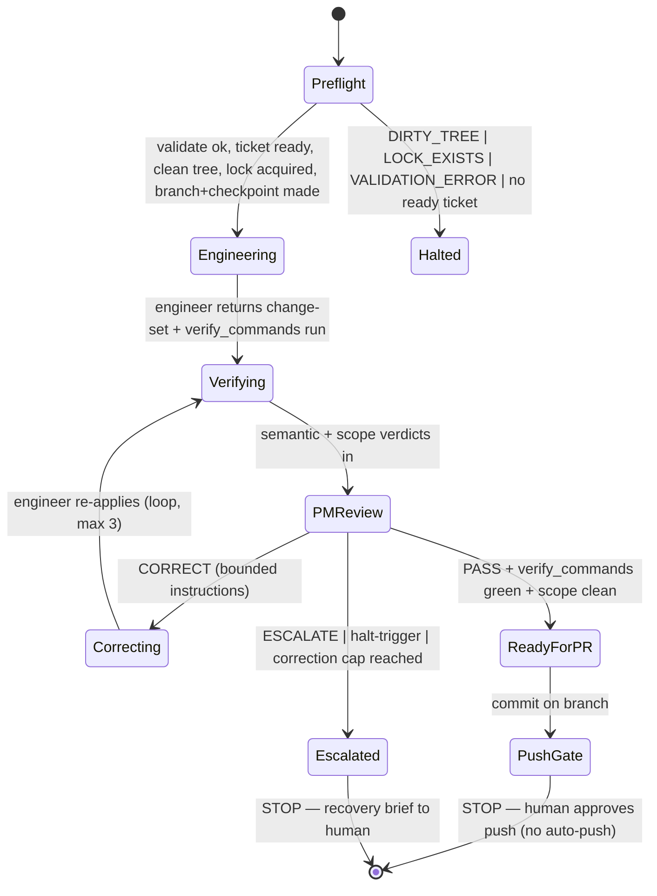

# One-Ticket Orchestration — Design (for review, not yet built)

**Status:** Draft for Dan's review. No implementation until approved.
**Scope:** Execute exactly ONE ticket, end to end, with agent dispatch, and STOP at the push gate.

---

## 1. Scope & non-goals

**In scope:** take a *valid* contract, select the next ready ticket (reusing `forge run --dry-run`),
dispatch engineer → semantic-verifier → scope-verifier → PM for that one ticket, loop on corrections up
to a cap, commit the result on an isolated branch, and **stop at the push gate** for a human.

**Explicit non-goals (this increment):** no multi-ticket loop, no auto-push, no auto-merge, no PR creation,
no hooks, no `--force`, no headless execution. Live execution is an **interactive Claude Code orchestration**
— never headless `claude -p` — so it stays on the flat subscription and keeps a human at the gate.

## 2. Architecture: where the decision vs the dispatch lives

- **Forge Core (CLI, deterministic, reusable):** validation, ticket selection, gate computation, branch-name
  derivation, status sync. The orchestrator calls `forge run <epic> --dry-run --json` to get the plan.
- **Interactive orchestrator (Claude Code session):** the only thing that can dispatch the charter subagents
  (via the Task tool), run git, write runtime state, and pause at gates. It is *mechanical* — it makes no code
  judgments (those belong to the agents). Likely surfaced as a command `/forge-run-ticket <epic-path>`.

This split keeps Core unit-testable and the orchestrator thin.

## 3. Preconditions (all must hold or the run refuses)

1. `forge validate` is clean (no error findings).
2. `forge run --dry-run` selects a ready ticket (not BLOCKED).
3. Git working tree is clean (no uncommitted changes) → else `DIRTY_TREE` halt.
4. No active lock for this epic → else `LOCK_EXISTS` halt.

## 4. Runtime state files (repo-local, gitignored under `.forge/`)

### `docs/epics/<slug>/.forge/active-ticket.json`
Written when the run starts; the deterministic source of "what is active" (future hooks read this).
```json
{ "epic": "<slug>", "sprint": "<sprint-id>", "ticket": "T03",
  "branch": "forge/<slug>/T03-<slug>",
  "allowed_paths": [...], "forbidden_paths": [...],
  "protected_paths": ["docs/governance/**", "**/JOURNAL.md", "**/DECISIONS.md"],
  "gate": { "declared": "pr", "effective": "manual", "human_required": true },
  "phase": "engineering", "checkpoint": { "head": "<sha>", "base": "main" },
  "timestamp": "<iso>" }
```

### `docs/epics/<slug>/.forge/lock.json`
Prevents two concurrent runs mutating one epic.
```json
{ "session_id": "<id>", "command": "forge-run-ticket", "ticket": "T03",
  "started_at": "<iso>", "branch": "<branch>", "pid": <n> }
```
Stale-lock detection by age/pid; never silently overwritten — `LOCK_EXISTS` shows recovery options.

### `JOURNAL.md` append protocol
Append-only via the journal module only. Every transition appends one timestamped entry:
`engineer dispatched`, each agent verdict, PM decision (with `D-nnn`), gate reached, lock acquired/released.
A `PreToolUse` hook (later) will deny direct edits to `JOURNAL.md`.

## 5. Branch & checkpoint policy

- Branch: `forge/<epic-id>/<ticket-id>-<slug>` off `manifest.integration_base` (default `main`). **Never** work on `main`.
- One ticket per branch. No mixing.
- **Checkpoint** before the engineer starts: record `{branch, HEAD, dirty-status, ticket, timestamp}` to the journal.
- On unrecoverable failure after the correction cap: produce a **recovery brief** (files changed + checkpoint to
  revert to); offer rollback; never leave the repo ambiguous. Merge strategy (squash) is a *later* concern (no merge here).

## 6. The one-ticket state machine



## 7. Dispatch packets (exact inputs per agent)

Built by the orchestrator from the contract + git; each agent gets only what it needs.

- **engineer:** ticket front-matter + body; governance docs; `allowed_paths`/`forbidden_paths`; branch; prior
  PM correction instructions (if re-attempt); the required output schema.
- **semantic-verifier:** acceptance criteria; engineer change-set; `git diff` for changed files; `verify_commands` output; output schema.
- **scope-verifier:** `git diff --name-status`; `allowed_paths`/`forbidden_paths`; `active-ticket.json`; output schema.
- **pm:** engineer output; both verifier outputs; `verify_commands` results; journal tail; halt-triggers; output schema.

## 8. Structured outputs (and a planned Core check)

Agents emit the YAML schemas from their charters (engineer change-set; verifier verdict+findings; PM decision).
**Planned Core capability (your hardening item):** Forge Core will *parse and validate* each agent's output against
a schema (Zod), the same way it validates the contract. Invalid/unparseable agent output ⇒ `AGENT_OUTPUT_INVALID`
⇒ escalate (never guessed past). For the first run we request the schema in-prompt; the Core validator is the
immediate follow-up so the orchestrator never trusts free-form agent text.

## 9. Correction loop

- Cap: **3** engineer↔verify↔PM cycles. On the 4th need → `CORRECTION_CAP_REACHED` ⇒ escalate with recovery brief.
- Each CORRECT carries bounded, specific instructions; the engineer re-attempts within the same branch.

## 10. Push-gate stop condition

When the PM returns `PASS` and `verify_commands` are green and scope is clean, the orchestrator commits the work on
the ticket branch, sets ticket `status` toward `ready_for_pr`, journals it, **and stops.** It does **not** push,
open a PR, or merge. The human reviews the branch and decides. (Auto-push/PR/merge is a later increment.)

## 11. Failure taxonomy (reuses the core error codes)

| Code | Orchestrator action |
|---|---|
| `VALIDATION_ERROR` | stop in preflight |
| `DIRTY_TREE` | stop, ask the human |
| `LOCK_EXISTS` | stop, show recovery options |
| `AGENT_OUTPUT_INVALID` | escalate (never guess) |
| `VERIFY_COMMAND_FAILED` | correct (loop, to cap) |
| `SCOPE_VIOLATION` | correct (revert offending change); escalate if repeated |
| `GATE_REQUIRED` | pause for the human (push gate) |
| `CORRECTION_CAP_REACHED` | escalate + recovery brief |
| `ROLLBACK_REQUIRED` | rollback to checkpoint (with human OK) |
| `UNKNOWN_ESCALATION` | escalate (fail safe) |

## 12. Open questions for Dan

1. **Surface:** a `/forge-run-ticket <epic-path>` Claude command (orchestrator), or drive it ad-hoc from a session first?
2. **Commit at push gate:** should the orchestrator *commit* on the branch before stopping (my assumption), or stop *before* committing and let the human commit?
3. **Agent-output Core validator:** build it *before* the first live run (safer) or immediately *after* (faster to a demo)?
4. **Status write-back:** on PASS, do we update the ticket front-matter `status` + manifest now, or only at merge time (later)?
