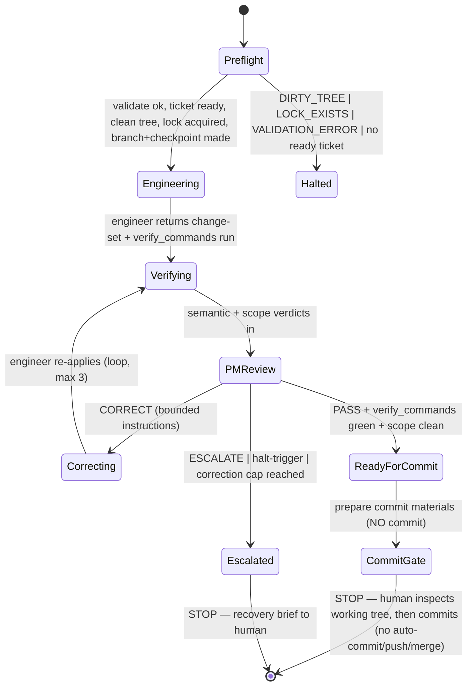

# One-Ticket Orchestration — Design (for review, not yet built)

**Status:** Draft for Dan's review. No implementation until approved.
**Scope:** Execute exactly ONE ticket, end to end, with agent dispatch, and STOP at the push gate.

---

## 1. Scope & non-goals

**In scope:** take a *valid* contract, select the next ready ticket (reusing `forge run --dry-run`),
dispatch engineer → semantic-verifier → scope-verifier → PM for that one ticket, loop on corrections up
to a cap, commit the result on an isolated branch, and **stop at the push gate** for a human.

**Explicit non-goals (this increment):** no multi-ticket loop, no auto-push, no auto-merge, no PR creation,
no hooks, no `--force`, no headless execution. Live execution is an **interactive Claude Code orchestration**
— never headless `claude -p` — so it stays on the flat subscription and keeps a human at the gate.

### v1 live-run constraints (Dan's release-gate decisions)

1. **Ad-hoc / session-driven first** — the first live run is driven visibly from an interactive session so we can
   watch dispatch and inspect intermediate outputs. It is wrapped as `/forge-run-ticket <epic-path>` only after
   one or two successful runs.
2. **Stop at a COMMIT gate, not after committing** — on PASS the orchestrator prepares commit materials (changed-file
   summary, verification summary, PM decision, suggested commit message + exact `git` command) and **stops**. It
   creates **no commit, no push, no PR, no merge.** A local commit is still durable repo state; the human inspects first.
3. **Agent-output validator is a hard prerequisite** — built and green *before* any live run (see §8).
4. **No contract/history writes in v1** — the engineer may edit **only** files inside the ticket's `allowed_paths`
   (implementation/tests). The run must NOT write ticket front-matter, `manifest.yaml`, `JOURNAL.md`, `DECISIONS.md`,
   or governance docs. Status write-back and journal appends come later, via tested write modules.
5. **Any need to touch a contract/governance/journal/manifest file is an immediate ESCALATE**, never a silent write.
6. On PASS, the orchestrator emits a **proposed** status transition (e.g. `T03 pending → ready_for_pr`) in its
   report — but does not apply it.

## 2. Architecture: where the decision vs the dispatch lives

- **Forge Core (CLI, deterministic, reusable):** validation, ticket selection, gate computation, branch-name
  derivation, status sync. The orchestrator calls `forge run <epic> --dry-run --json` to get the plan.
- **Interactive orchestrator (Claude Code session):** the only thing that can dispatch the charter subagents
  (via the Task tool), run git, write runtime state, and pause at gates. It is *mechanical* — it makes no code
  judgments (those belong to the agents). Likely surfaced as a command `/forge-run-ticket <epic-path>`.

This split keeps Core unit-testable and the orchestrator thin.

## 3. Preconditions (all must hold or the run refuses)

1. `forge validate` is clean (no error findings).
2. `forge run --dry-run` selects a ready ticket (not BLOCKED).
3. Git working tree is clean (no uncommitted changes) → else `DIRTY_TREE` halt.
4. No active lock for this epic → else `LOCK_EXISTS` halt.

## 4. Runtime state files (repo-local, gitignored under `.forge/`)

### `docs/epics/<slug>/.forge/active-ticket.json`
Written when the run starts; the deterministic source of "what is active" (future hooks read this).
```json
{ "epic": "<slug>", "sprint": "<sprint-id>", "ticket": "T03",
  "branch": "forge/<slug>/T03-<slug>",
  "allowed_paths": [...], "forbidden_paths": [...],
  "protected_paths": ["docs/governance/**", "**/JOURNAL.md", "**/DECISIONS.md"],
  "gate": { "declared": "pr", "effective": "manual", "human_required": true },
  "phase": "engineering", "checkpoint": { "head": "<sha>", "base": "main" },
  "timestamp": "<iso>" }
```

### `docs/epics/<slug>/.forge/lock.json`
Prevents two concurrent runs mutating one epic.
```json
{ "session_id": "<id>", "command": "forge-run-ticket", "ticket": "T03",
  "started_at": "<iso>", "branch": "<branch>", "pid": <n> }
```
Stale-lock detection by age/pid; never silently overwritten — `LOCK_EXISTS` shows recovery options.

### `JOURNAL.md` append protocol
Append-only via the journal module only. Every transition appends one timestamped entry:
`engineer dispatched`, each agent verdict, PM decision (with `D-nnn`), gate reached, lock acquired/released.
A `PreToolUse` hook (later) will deny direct edits to `JOURNAL.md`.

## 5. Branch & checkpoint policy

- Branch: `forge/<epic-id>/<ticket-id>-<slug>` off `manifest.integration_base` (default `main`). **Never** work on `main`.
- One ticket per branch. No mixing.
- **Checkpoint** before the engineer starts: record `{branch, HEAD, dirty-status, ticket, timestamp}` to the journal.
- On unrecoverable failure after the correction cap: produce a **recovery brief** (files changed + checkpoint to
  revert to); offer rollback; never leave the repo ambiguous. Merge strategy (squash) is a *later* concern (no merge here).

## 6. The one-ticket state machine



## 7. Dispatch packets (exact inputs per agent)

Built by the orchestrator from the contract + git; each agent gets only what it needs.

- **engineer:** ticket front-matter + body; governance docs; `allowed_paths`/`forbidden_paths`; branch; prior
  PM correction instructions (if re-attempt); the required output schema.
- **semantic-verifier:** acceptance criteria; engineer change-set; `git diff` for changed files; `verify_commands` output; output schema.
- **scope-verifier:** `git diff --name-status`; `allowed_paths`/`forbidden_paths`; `active-ticket.json`; output schema.
- **pm:** engineer output; both verifier outputs; `verify_commands` results; journal tail; halt-triggers; output schema.

## 8. Structured outputs (and a planned Core check)

Agents emit the YAML schemas from their charters (engineer change-set; verifier verdict+findings; PM decision).
**Forge Core agent-output validator is a HARD PREREQUISITE — built and green before any live run** (not a
follow-up). Core parses and validates each agent's output against a Zod schema, the same way it validates the
contract. Malformed / missing-field / invalid-enum / unknown-field / prose-only ("looks good") output ⇒
`AGENT_OUTPUT_INVALID` ⇒ escalate. The orchestrator **never** infers or repairs agent output; it acts only on
validated structure. This is the **next implementation slice** (§13), before any dispatch.

## 9. Correction loop

- Cap: **3** engineer↔verify↔PM cycles. On the 4th need → `CORRECTION_CAP_REACHED` ⇒ escalate with recovery brief.
- Each CORRECT carries bounded, specific instructions; the engineer re-attempts within the same branch.

## 10. Commit-gate stop condition (v1)

When the PM returns `PASS`, `verify_commands` are green, and scope is clean, the orchestrator **prepares** a
commit handoff and **stops** — it does not commit, push, PR, or merge:
- changed-file summary, verification summary, PM decision, recovery brief;
- a suggested commit message and the exact suggested `git` command;
- a **proposed** status transition (e.g. `T03 pending → ready_for_pr`) — not applied.

The human inspects the working tree and commits if satisfied. A later increment may upgrade this to
"commit locally on the branch, then stop" once the loop is proven; auto-push/PR/merge remains out of scope.

## 11. Failure taxonomy (reuses the core error codes)

| Code | Orchestrator action |
|---|---|
| `VALIDATION_ERROR` | stop in preflight |
| `DIRTY_TREE` | stop, ask the human |
| `LOCK_EXISTS` | stop, show recovery options |
| `AGENT_OUTPUT_INVALID` | escalate (never guess) |
| `VERIFY_COMMAND_FAILED` | correct (loop, to cap) |
| `SCOPE_VIOLATION` | correct (revert offending change); escalate if repeated |
| `GATE_REQUIRED` | pause for the human (push gate) |
| `CORRECTION_CAP_REACHED` | escalate + recovery brief |
| `ROLLBACK_REQUIRED` | rollback to checkpoint (with human OK) |
| `UNKNOWN_ESCALATION` | escalate (fail safe) |

## 12. Decisions (resolved by Dan)

1. **Surface:** ad-hoc/session-driven first; wrap as `/forge-run-ticket` only after 1–2 successful runs.
2. **Commit point:** stop at a COMMIT gate — prepare materials, create no commit (no push/PR/merge).
3. **Agent-output validator:** build it BEFORE the first live run (hard prerequisite).
4. **Status write-back:** deferred — no contract/manifest/journal/decisions/governance writes in v1; PM PASS emits a *proposed* transition only.

## 13. Next implementation slice (build this, nothing else)

**Agent-output schemas + parser/validator** — no agent dispatch yet.
- `src/agents/schemas.ts` — Zod schemas for engineer, semantic-verifier, scope-verifier, and PM outputs (`.strict()`).
- `src/agents/parse-output.ts` — parse YAML, validate against the named agent's schema, return a typed
  success or a structured `AGENT_OUTPUT_INVALID` failure. Never infer or repair; reject prose-only output.
- `src/agents/parse-output.test.ts` — valid passes; engineer missing `commands_run` fails; semantic verifier
  missing evidence fails; semantic verifier prose-only "looks good" fails; scope verifier invalid `verdict`
  fails; PM missing `decision`/`rationale` fails; PM invalid `decision` enum fails; malformed YAML fails;
  unknown top-level field fails.

Only after this is green do we design/build the ad-hoc first live one-ticket run.
